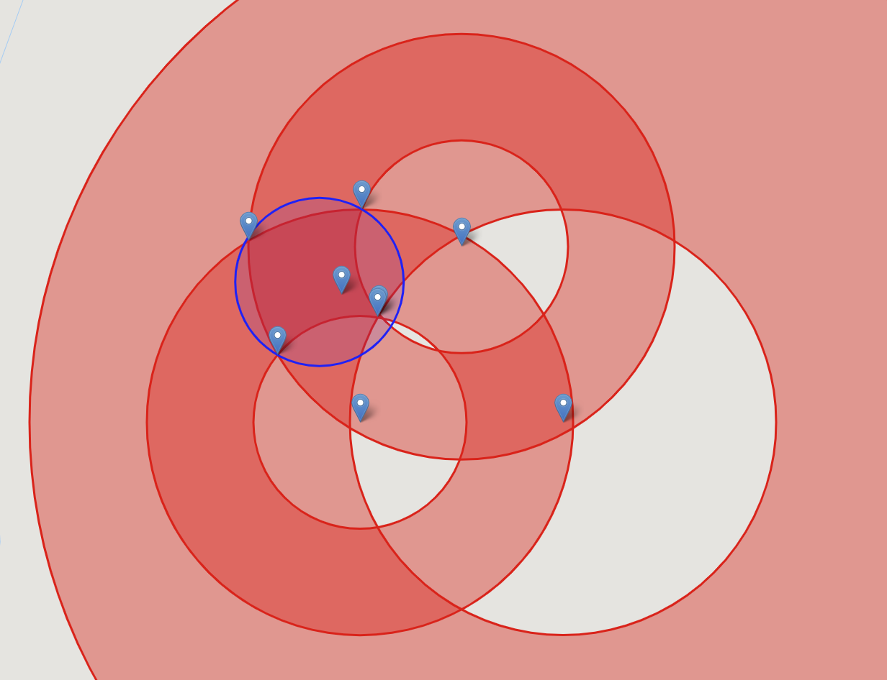

# bucket-multilateration

This is a node module for triangulating/trilaterating/multilaterating an object when you know how far it is from two or more beacons of known location *and* the distances are obfuscated into buckets eg. 0m-500m, 500m-1000m etc.

It could also be called annulus-trilateration, annuli-trilateration or torus-trilateration, but I've gone for bucket trilateration because torus is incorrect and annulus makes certain people snigger...

This is a python version of [bucket-trilateration](https://github.com/kbb29/bucket-trilateration).  However, the JS and Python algorithms are very different.  This one (python) has complexity greater than n**2, so will not perform well with large numbers of beacons.  But this one is more likely to get the correct answer.

## algorithm details

The algorithm is based around the concept of beacons.  A beacons is a fixed point on earth.  You know that the distance from the beacon to some target object is between two limits eg. between 500m and 1000m away.  You have this kind of distance estimate for multiple beacons and you want to know the area in which the target object could be located.

1. first we calculate the positions of all the points where two beacon limits intersect.
1. Then we calculate which of these limit intersections lie on the boundary of the target area.
1. Then we find the smallest circle which encloses all the target boundary points and return this.

